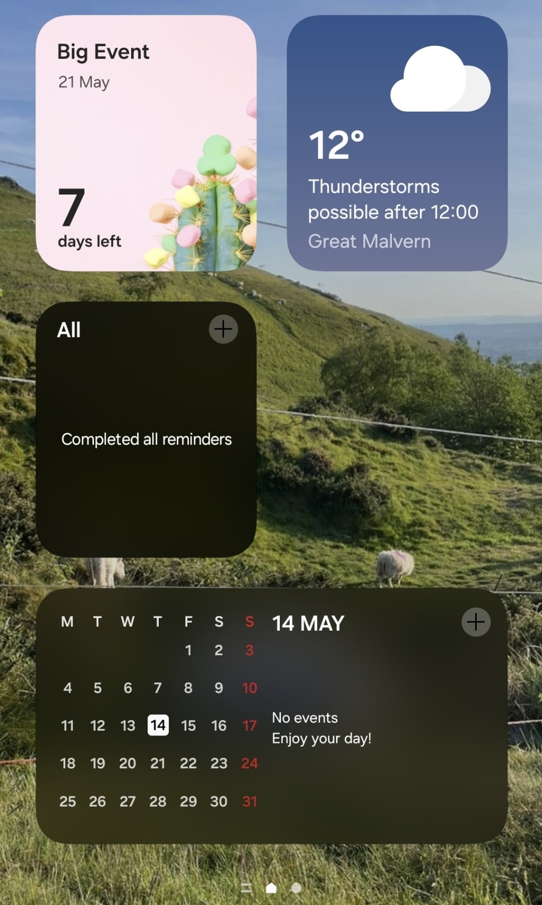
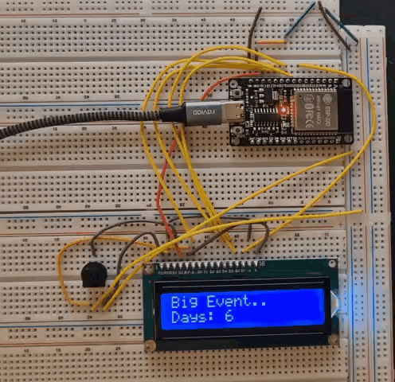
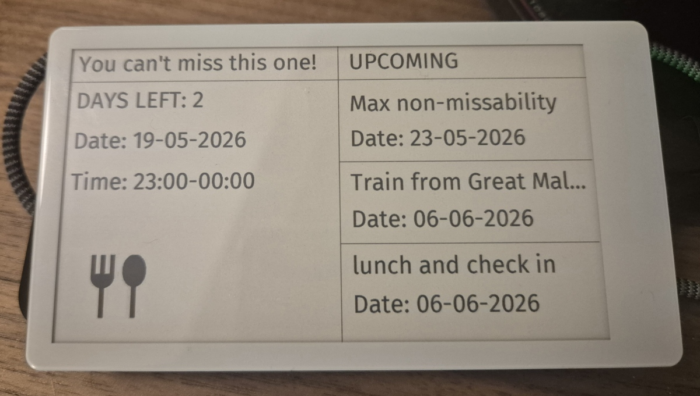

# Important Eventer System

## Overview

Android devices feature a calendar widget that enables users to select and display significant calendar events:

However, this functionality presents several limitations:

1. **Manual Event Management**: The next event must be manually configured and fails to automatically update once the selected date has passed.

2. **Digital Display Limitations**: The system operates as a digital display requiring direct device attention to view upcoming dates.

3. **Configurability**: The days left counter counts the day that you are currently on. I wanted my system to not do so.

The Important Eventer represents a comprehensive solution addressing these constraints through a physical visual display of critical upcoming events. The system comprises three integrated components:

1. **Hosted iCal Feed** utilizing Radicale for calendar synchronization

2. **iCal to JSON Conversion Server** using Go for data processing

3. **Microcontroller Display Interface** utilizing LCD technology for visual presentation

## Architecture

## Implementation

- **Components 1 and 2** integrate through a docker-compose configuration suitable for homelab deployment ([see here](./docker-compose/compose.yml))

- **Component 3** operates independently with dedicated hardware setup

Currently there are two implementations:

### LCD Implementation

### E-Paper Implementation

## Future Improvements

### LCD Implementation

Nothing, this was my prototype and I will not be working on this one more.

### E-Paper Implementation

Nothing at the moment, feel free to suggest ideas.